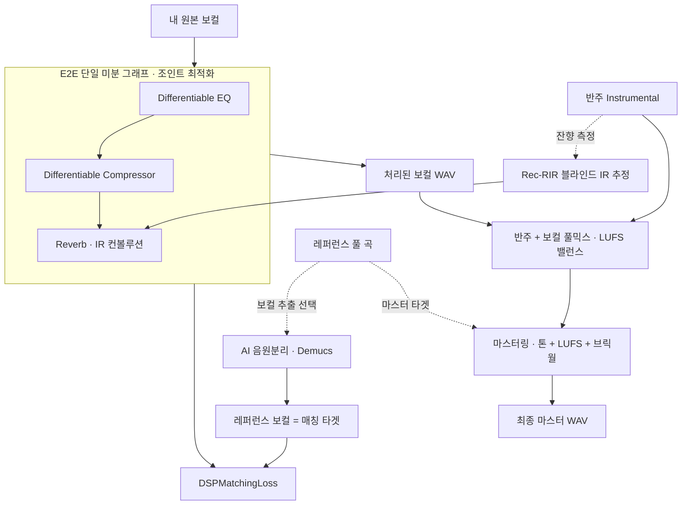

# ⚡ DDSP Vocal Auto-Mix (보컬 톤·다이내믹·공간감 자동 매칭 시스템)

본 프로젝트는 미분 가능한 디지털 신호처리(**DDSP, Differentiable Digital Signal Processing**)와 경사하강 최적화, 그리고 블라인드 RIR 식별(Rec-RIR)을 결합해, **내 원본 보컬을 레퍼런스 보컬의 음색(EQ)·다이내믹(Compression)·공간감(Reverb)에 맞춰 자동으로 믹싱**하고 반주와 합쳐 **마스터링까지 마감**하는 시스템입니다.

생성 모델(GAN·WaveNet 등)을 쓰지 않으므로 결과가 EQ 커브·ratio·RT60·LUFS 같은 **사람이 읽고 검증할 수 있는 수치**로 남습니다. 학술 캡스톤 프로젝트이자 자동 마스터링 엔진의 구조적 근간으로 설계되었습니다.

> **문서 기준일**: 2026-08-19 (코드와 동기화됨)

---

## 🧬 시스템 아키텍처 및 신호 흐름



**엔진은 E2E 하나입니다.** 예전의 순차(greedy) 엔진 — EQ 500 epoch → numpy 1176 컴프 이진탐색 → 리버브 100 epoch — 은 `legacy/` 에 보관만 하며 API 에서 선택할 수 없습니다(`main.py` 의 `engine` 플래그 삭제).

---

## 0단계: AI 음원 분리 — 레퍼런스 보컬 자동 추출 (선택)

* **문제 해결**: 기존 톤 매칭은 레퍼런스로 **아카펠라**가 필요했지만 구하기 어렵습니다. 이 기능을 켜면 **좋아하는 곡의 풀 믹스**를 그대로 업로드해도 됩니다.
* **Demucs 분리**: `torchaudio` 내장 **Hybrid Demucs(HDEMUCS_HIGH_MUSDB_PLUS)** 로 `drums / bass / other / vocals` 4스템 분리 → **vocals 스템**을 매칭 타겟으로 사용합니다. 별도 pip 패키지 불필요, 가중치는 첫 실행 시 자동 다운로드·캐시.
* **긴 오디오 처리**: 10초 세그먼트 + `Fade` overlap-add 로 메모리 폭주와 경계 아티팩트를 동시에 방지. 스템은 `-1 dBFS` 피크 정규화.
* `separate_vocals(song, vocals_out, inst_out=None)` — `inst_out` 을 주면 나머지 스템 합(drums+bass+other)을 반주로도 뽑습니다.

---

## 1단계: E2E 조인트 매칭 (핵심)

### 왜 순차 최적화로는 부족한가

EQ 를 확정한 뒤 컴프를 걸면 피크가 눌리며 음색이 변하고, 리버브를 걸면 잔향 테일이 토날 밸런스를 재차 흔듭니다. **앞 단계에서 확정한 파라미터가 뒷 단계를 거치고 나면 더 이상 최적이 아닙니다.**

### 신호 흐름 — numpy 왕복 0회

```
forward:   STFT → EQ → iSTFT → Compressor → Reverb        (직렬, numpy 왕복 0회)
backward:  L_tone ← tone_src = Reverb(Comp(y_eq, sg[θ_T])) → θ   (EQ)
           L_dyn  ← dyn_src  = Reverb(Comp(sg[y_eq], θ_T)) → θ_T (Comp)
           ※ 리버브 통과 여부는 LOSS_MEASURE_POINT ("post_reverb" 기본)
```

기존 `match_eq` 는 EQ 학습 후 `.numpy()` / `librosa.istft` 로 그래프를 빠져나갔다가 미분 불가능한 numpy 1176 컴프를 거쳐 `torch.tensor()` 로 그래프를 새로 시작했습니다. 이 절단 지점들을 `torch.stft` / `torch.istft` 체인으로 전부 대체했습니다.

**컴프는 iSTFT 뒤(시간 영역)에 둡니다.** 다이내믹 타겟이 피크 기반 지표(크레스트 팩터 = True Peak − RMS)이므로 디텍터가 실제 피크를 봐야 하기 때문입니다 — 자세한 근거는 아래 "컴프레서 설계" 참조.

### 핵심 난제: Non-identifiability

손실을 하나로 합치면 최적화가 실패합니다. 파라미터 수가 **EQ 17개 vs 컴프 1개 vs 리버브 0~1개**라 손실을 낮추는 가장 빠른 경로가 언제나 EQ 입니다. 예전 구현에서는 리버브 `wet`→0, 컴프 `ratio`→1 로 죽고 **EQ 혼자 움직인 채 "수렴"** 하는 일이 실제로 일어났습니다.

한동안은 이것을 **손실 설계의 불변성**(레벨 불변·EQ 소거)과 침범 방지용 정규화 항으로 통제했습니다. 지금은 더 단순하게, **그래디언트 경로 자체를 끊습니다.**

### DSPMatchingLoss (`losses.py`) — 손실을 합치지 않는다

```python
# LOSS_GRAD_MODE = "selective" (기본). sg[·] = stop-gradient(detach)
tone_src = chain.comp(y_eq, detach_params=True)   # Comp(y_eq, sg[θ_T])
dyn_src  = chain.comp(y_eq.detach())              # Comp(sg[y_eq], θ_T)

# LOSS_MEASURE_POINT = "post_reverb" (기본) → 둘 다 리버브를 한 번 더 통과한 뒤 손실로
tone_src = chain.apply_reverb(tone_src, reverb_amount).mean(dim=0)
dyn_src  = chain.apply_reverb(dyn_src,  reverb_amount).mean(dim=0)

L_tone_total = criterion.tone_loss(tone_src, target) + eq_l2 항 + eq_smooth 항  # θ 로만
L_dyn_total  = criterion.dyn_loss(dyn_src,  target) + comp_thresh 항            # θ_T 로만

L_tone_total.backward()
L_dyn_total.backward()
optimizer.step()      # 파라미터 집합이 겹치지 않아 단일 Adam 으로 충분
```

**두 손실 모두 컴프 통과 후 신호에서 재되, 그래디언트 경로만 가릅니다.** `sg` 는 forward 값을 바꾸지 않으므로 `tone_src` · `dyn_src` · 실제 최종 출력이 **수치적으로 동일**합니다 — "손실이 듣는 소리"는 최종 출력과 같으면서, `sg[y_eq]` 가 `∂L_dyn/∂θ ≡ 0` 을, `sg[θ_T]` 가 `∂L_tone/∂θ_T ≡ 0` 을 보장합니다. **각 손실이 자기 모듈만 움직인다는 성질이 구조적으로 보장**되므로, 침범 방지용 정규화(`comp_anchor`)와 항 가중치(`w₁/w₂`)는 삭제했습니다. 학습 속도 조절은 모듈별 학습률(EQ 0.05 / Comp 0.02)이 담당합니다.

> **측정 지점 (`LOSS_MEASURE_POINT`, 기본 `"post_reverb"`)**: 두 손실은 **리버브까지 통과한 신호**에서 잽니다. EQ·컴프의 그래디언트가 리버브 컨볼루션을 관통해 흐르므로(리버브에 학습 파라미터가 없어도 컨볼루션은 선형이라 backward 가 성립), 손실이 듣는 소리가 실제 저장되는 출력과 같아집니다. `"pre_reverb"` 로 두면 예전처럼 컴프 출력에서 재고 리버브는 렌더 전용 후처리가 됩니다. 렌더와 학습이 같은 `E2EChain.apply_reverb` 를 공유하므로 이 동일성은 정의상 보장됩니다.
>
> 대가는 학습 시간입니다 — 스텝마다 곡 전체 FFT 컨볼루션이 tone·dyn 각각 하나씩 backward 까지 붙습니다. 실측(50스텝, 측정 IR): 128 s 소재 38.4 s → **81.5 s (2.12배, 스텝당 +0.84 s)**, 154 s 소재 45.7 s → **89.7 s (1.96배)**. "리버브 4조합 모두 렌더"는 학습을 4번 도는 옵션이라 이 배수가 그대로 곱해집니다.

> `LOSS_GRAD_MODE` 로 예전 모드도 남겨 뒀습니다 — `"split"`(톤을 컴프 **이전** `y_eq` 에서 측정)과 `"unified"`(sg 없이 둘 다 `y_full` 에서 측정). `"unified"` 는 실제 곡에서 다이내믹 지표가 목표와 반대로 튀고 EQ 가 저역을 −25 dB 까지 깎는 실패가 관측돼 재현용으로만 둡니다.

내 보컬과 레퍼런스는 **서로 다른 연주**라 프레임 단위 직접 비교가 불가능합니다. 세 손실 모두 **통계 도메인**으로 계산합니다.

| 손실 | 대상 모듈 | 측정 지점 | 계산 |
|---|---|---|---|
| `L_tone` | EQ | `tone_src = Reverb(Comp(y_eq, sg[θ_T]))` | 파워 스펙 시간평균 → mel 80밴드 → 평가 대역(200 Hz–10 kHz) 평균 dB 로 레벨 정렬 → L1 (대역 밖 마스킹) |
| `L_dyn` | 컴프 | `dyn_src = Reverb(Comp(sg[y_eq], θ_T))` | **크레스트 팩터 = True Peak(dBTP) − RMS(dB)** (하이라이트 15초 구간, σ_ST 보조항 없음) |
| `L_decay` | 리버브 | 리버브 출력 | STFT **bin별** 0.35초 윈도 → Schroeder 역적분 → dB → 시작값 정규화 → 최소자승 기울기(dB/s) → 8옥타브 대역 집계 |

> **`L_dyn` 의 측정 구간**: 컴프는 **하이라이트 15초**로 학습하고 지표도 같은 구간에서 잽니다(`COMP_TRAIN_SECONDS`). 15초로 학습하고 곡 전체로 채점하면 서로 다른 축을 비교하는 것이 됩니다 — 구간 통계라 구간을 바꾸면 값이 이동하고 그 이동량은 신호마다 다릅니다. `L_tone` 은 반대로 **곡 전체**입니다(짧은 구간이면 EQ 가 그 구간에 과적합됩니다).

#### `L_dyn` = 다이내믹 레인지 지표로 교체한 이유

* 현재 기본은 **크레스트 팩터** `CF(dB) = True Peak(dBTP) − RMS(dB)` 입니다(`losses.DSPMatchingLoss.DYN_METRIC = "crest"`). 순간 최대 피크와 지속 평균 음압의 격차, 즉 곡의 다이내믹 레인지입니다.
* **레벨 불변**: 전체 게인을 곱하면 True Peak 와 RMS 가 같은 dB 만큼 이동해 차이가 보존됩니다 → EQ·메이크업 게인이 이 손실을 대신 낮출 수 없고 그래디언트가 컴프로 갑니다. (실측: `×0.25 / ×1 / ×2` 에서 CF = 13.5161 로 동일.)
* **미분 가능 구현**: True Peak 는 4배 오버샘플 + straight-through(값은 진짜 `max`, 그래디언트는 상위 k=64 평균). `pyloudnorm` 은 numpy 라 그래디언트가 흐르지 않으므로 LUFS 경로도 **필터 계수만** 가져오고(동일 계수 보장) 적용은 전부 torch 로 재구현했습니다(`losses.LoudnessMeter`).
* 이전의 '음절 피크 편차'는 손실이 실제로 최적화하는 양과 달라 **화면 수치와 학습이 따로 놀았고**, 이진 탐색 컴프는 미분이 안 돼 조인트 그래프에 들어갈 수 없었습니다.

##### PLR → 크레스트 팩터로 다시 바꾼 이유

그 다음 정의는 `PLR = True Peak − Integrated LUFS` 였습니다(둘 다 ITU-R BS.1770-4). 문제는 분모의 LUFS 가 K-weighting + 2단 게이팅(절대 −70 LUFS, 상대 −10 LU)을 거치는데, **그 게이팅이 압축 깊이에 따라 TP 와 다른 속도로 움직인다**는 점입니다. threshold 스윕 실측(`은주막걸리`, R=30, −18 → −50 dB)에서 `ΔTP = −17.8 dB` 인데 `ΔLUFS = −22.1 dB` 라 **세게 누를수록 PLR 이 +4.4 dB 커지는** 비단조성이 나왔습니다.

| thr | −5 | −10 | −18 | −30 | −50 | 재상승 |
|---|---|---|---|---|---|---|
| CF (R=30) | 21.89 | 20.37 | 19.43 | 17.20 | **10.47** | +0.00 |
| PLR (R=30) | 13.83 | 13.03 | **12.77** | 13.62 | 17.15 | **+4.37** |

RMS 에는 그 문턱이 없어 신호 전체를 그대로 반영하고, 같은 스윕에서 CF 는 **단조 감소**합니다. 메이크업 게인은 원인이 아니었습니다(끄고 재현해도 재상승이 그대로, 폭만 0.5~1.0 dB 감소). PLR 로 되돌리려면 `DYN_METRIC = "plr"`.

* 지표는 스칼라 1개입니다. 예전에는 정보량이 빠듯하다고 보고 **단기(3 s) 라우드니스 표준편차 σ_ST** 를 보조항으로 더했는데, 그 항이 손실을 지배해 컴프를 감쇠기로 변질시키는 실패가 확인돼 **제거했습니다**(`USE_ST_TERM = False`). 학습 파라미터를 threshold 하나로 줄였으므로(ratio 는 3:1 상수) 스칼라 목표 하나로도 구속됩니다.

#### `L_decay` 의 EQ 소거 (레벨 불변성)

각 윈도의 EDC 를 **시작값으로 정규화**합니다. EQ 는 각 bin 에 상수 게인 `g_f²` 을 곱할 뿐이므로:

```
EDC_db(k) − EDC_db(0)
  = 10log₁₀(g_f²·Σ_{j≥k}E_j) − 10log₁₀(g_f²·Σ_{j≥0}E_j)
  = 10log₁₀(Σ_{j≥k}E_j) − 10log₁₀(Σ_{j≥0}E_j)          ← g_f 소거
```

이 소거는 **bin 단위로** EDC 를 뜬 뒤 대역으로 집계해야 성립합니다. 대역 에너지로 먼저 합치면 대역 내 EQ 게인 불균일(17밴드 EQ vs 8옥타브 대역) 때문에 소거가 깨집니다 — 실측에서 대역 8개일 때 리버브/EQ 그래디언트 비가 2.3배(24개로 늘려도 5.8배)에 그쳤습니다. 그래서 `decay_resolution="bin"` 이 기본값이고 `"band"` 는 메모리가 빠듯할 때의 근사 옵션입니다.

에너지 가중치는 `detach` 합니다 — 가중치를 통해 손실을 낮추는 우회 경로가 곧 EQ 누수 경로이기 때문입니다.

#### 정규화 항 (UI 슬라이더로 노출)

남아 있는 정규화는 모두 **모듈 자신의 파라미터 제약**입니다. 모듈 간 침범 방지는 `detach` 가 담당하므로 그 목적의 항은 없습니다.

| 항 | 소속 | 식 | 목적 |
|---|---|---|---|
| `eq_l2` (기본 0.1) | `L_tone_total` | `mean(γ²)` | 전체 부스트/컷 폭 억제 |
| `eq_smooth` (기본 0.1) | `L_tone_total` | `mean(diff(γ)²)` | 인접 밴드 요철 억제 → 매끈한 커브 선호 |
| `comp_thresh_weight` (기본 0) | `L_dyn_total` | `(threshold / -60)²` | threshold 를 내리는 쪽 그래디언트 지렛대가 길어 목표 다이내믹 지표를 threshold 바닥으로 맞춰 버리면 **컴프가 아니라 포락선 스케일러**가 됩니다. ratio 고정 이후 threshold 혼자 압축량을 감당하므로 더 중요해졌습니다 |

**삭제된 항**

* `comp_anchor_weight` (`exp(-(ratio-1))`) — ratio 를 상수로 고정해 bypass 흡인점 자체가 사라졌습니다(아래 "컴프레서 설계").
* `auto_balance` (각 항을 EMA 크기로 나누는 스케일 정규화) — 손실을 더하지 않으므로 단위를 맞출 이유가 없고, Adam 은 손실의 상수배에 거의 불변이라 어차피 no-op 에 가깝습니다. 리버브 경로를 합산 구조로 되돌릴 가능성이 있어 코드는 비활성 상태로 남겨 두었습니다.
* `w₁ / w₂` 항 가중치 — 모듈별 학습률과 역할이 중복입니다.

### EQ 설계

* **가우시안 필터뱅크**: log2 주파수 축에 등간격 배치된 밴드(constant-Q, 폭 `σ = 0.6 × 평균 간격`). 복소 STFT 에 실수 게인을 직접 곱해 **위상 보존**.
* **밴드 범위는 200 Hz ~ 10 kHz, 기본 17밴드**: `f_j = 200 · 50^(j/(J-1))`, Δ=0.3527 oct, σ=0.2116 oct. **손실의 평가 대역 Ω 와 정확히 일치**시킵니다 — 평가되지 않는 곳에 파라미터를 두면 그래디언트 없이 표류하고, 파라미터가 없는 곳을 평가하면 고칠 수 없는 오차만 쌓입니다.
  * 하한 200 Hz: 보컬 분리 과정에서 100~150 Hz 의 보컬이 악기에 마스킹되어 분리 모델이 그 대역을 복원하지 못합니다. 노이즈가 아니라 **정보 자체가 소실**된 구간입니다.
  * 상한 10 kHz: mp3 등 손실 압축 레퍼런스는 이 위 정보가 대부분 소실돼 있습니다. 실측(`Golden Acapella.mp3`)에서 17 kHz 위 raw−ref 가 **+43~+50 dB** 였는데, 이는 톤 차이가 아니라 코덱 절벽입니다.
  * **단일 진실 공급원**: `pipeline.VOCAL_EQ_MIN_FREQ` / `VOCAL_EQ_MAX_FREQ` 하나에서 EQ 밴드·`M_eq`·차트/지표 마스크가 모두 파생되고, 손실의 Ω 도 `match_e2e` 가 `tone_fmin`/`tone_fmax` 로 이 상수를 명시 전달합니다.
  * 배치 변천: 20 Hz~20 kHz/30밴드 → 100 Hz~20 kHz/23밴드 → 100 Hz~10 kHz/20밴드 → **200 Hz~10 kHz/17밴드**. 매번 새 범위에서 다시 균일 배치했으므로 옥타브 간격은 0.344~0.353 으로 거의 같습니다.
* **하드 클램프 제거**: `tanh(±max_gain_db)` 는 상한에 닿기 전까지 저항이 0 이라 결국 "일단 크게 밀고 벽에서 잘리는" 사후 절단과 같아집니다. E2E 엔진의 EQ 는 `hard_clamp=False` 로 두고, 게인 크기 제어를 **제곱 페널티**에 맡깁니다 — 1 dB 지점 대비 14 dB 지점의 한계비용이 약 10배라, 작은 보정은 거의 공짜로 두고 큰 부스트만 억제합니다. (마스터링 EQ 는 종전대로 `hard_clamp=True`.)
* **대역 바이패스**: `M_eq(f) = 1[200 ≤ f < 10000]`. 이 범위 밖은 EQ 게인 `0 dB` 이며 손실에서도 제외됩니다.
* **고정 HPF/LPF 는 삭제했습니다**: 예전에는 80 Hz HPF·16 kHz LPF 를 곱했는데, 이 마스크가 출력에만 걸리고 레퍼런스에는 안 걸려서 손실이 그 감쇠를 "톤 부족"으로 읽고 **EQ 가 되밀어 올렸습니다**(실측 8–20 kHz 에서 +4.82 dB). 게다가 `1/(1+(f/fc)^(2p))` 는 버터워스 *파워* 응답인데 진폭 배수로 써서 감쇠가 2배였습니다(fc 에서 −6 dB). 대역 제한은 `M_eq` 하나가 담당합니다.

### 컴프레서 설계 (`modules.DifferentiableCompressor`)

**학습 파라미터는 threshold 하나뿐**이고, **ratio 는 사용자가 고르는 상수**(기본 3:1), 시정수도 상수입니다.

* **파라미터화**: `threshold = −60·σ(raw)` → [−60, 0] dB. ratio 는 파라미터도 버퍼도 아닌 **평범한 float** 입니다 — 그래프에 없다는 것이 코드에서 바로 보이게 하려는 의도입니다.
* **ratio 는 학습하지 않을 뿐 고정값은 아닙니다**: `pipeline.COMP_RATIO`(기본 3.0)로 잡고 API `comp_ratio` · UI 슬라이더(1~30)로 곡마다 바꿉니다. 허용 범위는 `[1, 1000]` — 1 은 무압축, 큰 값은 사실상 리미터입니다. 상한을 유한하게 둔 이유는 게인 식 `−o·(1 − 1/R)` 자체는 `R = inf` 를 문제없이 처리하지만(`1/inf = 0`) 그 값이 JSON 응답에 실려 나가는데 `Infinity` 가 유효한 JSON 이 아니기 때문입니다(프론트의 `JSON.parse` 가 던집니다). `R = 1000` 이면 계수가 0.999 라 실용적으로 리미터입니다.
* **왜 ratio 를 학습하지 않는가**: 이전 파라미터화 `ratio = 1 + exp(raw)` 의 도함수는 `d(ratio)/d(raw) = ratio − 1` 이라, **컴프가 아무 일도 하지 않는 지점(ratio=1)에서 그래디언트가 정확히 0** 이 됩니다. bypass 가 흡인점이 되어 한 번 그쪽으로 흘러가면 되돌릴 힘이 없습니다. 예전에는 `exp(-(ratio-1))` 벌점으로 밀어냈지만 그건 기하 문제를 가린 것이고, 파라미터를 없애면 퇴화 방향 자체가 사라집니다.
* **ratio 가 도달 범위를 정합니다**(크레스트 팩터 지표 기준 실측, `은주막걸리` 소재): `R=3` 은 threshold 를 −50 dB 까지 내려도 CF 17.71 이 한계지만, `R=30` 이면 10.47 까지 내려가 목표 12.16 을 지납니다. 소재가 목표에 못 닿으면 threshold 가 아니라 ratio 를 올리는 것이 맞습니다.
* **부수 효과**: `(threshold, ratio)` 축퇴도 함께 사라집니다. 같은 다이내믹 감소를 만드는 조합이 무수히 많은데 목표는 스칼라 하나(다이내믹 레인지 지표)뿐이라 둘 다 자유로우면 해가 약하게만 결정됐습니다. 대신 threshold 혼자 압축량을 감당하므로 바닥에 붙을 위험이 커져 `comp_thresh_weight` 의 역할이 커졌습니다.
* **시간 영역 피크 디텍터 (hop 128 ≈ 2.9 ms)**: STFT 프레임 RMS 디텍터로 재봤더니 128초 보컬에서 지속 음량은 17.4 dB 내려가는데 True Peak 는 13.8 dB 만 내려가 **다이내믹 지표가 오히려 올라갔습니다(당시 PLR 기준 14.2 → 17.8 dB)**. 11.6 ms 홉의 RMS 로는 짧은 트랜지언트를 볼 수 없습니다 — 분모만 움직이고 피크는 남으므로 실패 양상은 크레스트 팩터에서도 같습니다.
* **밸리스틱 (one-pole, 어택 0.5 ms / 릴리즈 120 ms 상수)**: 이게 없으면 시정수가 아예 없어 컴프가 아니라 게인 오토메이션입니다. 계수를 학습 대상으로 만들면 threshold 와 뒤엉켜 최적화만 어려워집니다.
* **커스텀 autograd (`_OnePoleBallistics`)**: one-pole 재귀를 파이썬 루프로 autograd 에 태우면 프레임 수만큼 깊은 그래프가 생겨 15초 구간 200스텝이 **34분**(10초/60스텝은 16초)이 걸렸습니다. 비용이 연산량이 아니라 그래프 깊이를 따라 초선형으로 증가한 것입니다.
  전방 재귀는 autograd 밖 float 연산으로 돌리고 선택된 계수만 저장, 역방향은 **수반(adjoint) 선형 재귀** `s[t] = grad_out[t] + a[t+1]·s[t+1]`, `grad[t] = (1−a[t])·s[t]` 로 계산해 `O(T)` 시간·메모리로 줄였습니다. `g[t] < y[t−1]` 분기는 거의 모든 곳에서 그래디언트가 0 인 이산 선택이라 **고정해도 근사가 아니라 정확**합니다.
* **오토 메이크업**: 활성 구간(> max−45 dB) 평균 GR 을 되돌리는 상수 dB 오프셋. 크레스트 팩터·PLR 같은 레벨 불변 지표에는 영향이 없고 출력 레벨만 쓸 만하게 유지합니다.

### 학습 구간 = 곡 전체

`L_tone` 을 짧은 학습 구간에서만 재면 EQ 가 그 구간에 **과적합**되어 곡 전체 기준 톤이 무처리 원본보다 나빠지는 현상이 실측됐습니다(2.419 vs 원본 2.369). 현재는 **곡 전체를 학습 구간으로** 씁니다(속도보다 정확도).

톤은 장기 평균 통계이고 EQ 는 모든 프레임에 동일한 게인을 곱하므로 장기 평균에 대한 효과가 닫힌 형태로 분리됩니다:

```
mean_t |EQ(f)·S(f,t)|² = EQ(f)² · mean_t|S(f,t)|²
```

이 성질은 `_loss_tone_from_avg` 경로로 남아 있어, 짧은 구간 학습이 필요할 때 곡 전체 평균 스펙트럼에 EQ 를 해석적으로 곱해 톤만 전역 기준으로 정렬할 수 있습니다.

부분 구간을 쓰는 경우를 위한 `extract_training_segments` 는 RMS 상위 N개 블록을 **등파워(sin/cos) 크로스페이드**로 잇습니다. 그냥 `torch.cat` 하면 경계에 없던 attack/decay 가 생겨 `L_decay` 를 직접 오염시키기 때문입니다.

---

## 2단계: 공간감 — 합성 리버브에서 **측정 IR** 로

### 왜 바꿨나

`노이즈 × exp(-at)` 합성 IR 은 모양이 지수함수 하나로 강제됩니다.

* 대역별 감쇠를 표현하지 못합니다(실측 100 Hz 0.73 s vs 8 kHz 0.65 s — 거의 동일). 실제 방은 고역이 먼저 죽습니다.
* 0 ms 부터 에코 밀도가 최대 = 초기반사가 없습니다. 물리적으로 완벽히 확산된, **실재하지 않는 공간**의 소리("화장실 같은" 느낌)가 납니다.

구버전 IR 추출기(`legacy/ir_extract.py`, 감쇠 구간 STFT 크기의 중앙값)는 더 나빴습니다 — IR 이 아직 **−9 dB 밖에 안 떨어진 281 ms 지점에서 하드 컷**(게이트 리버브처럼 끊김)되고, 감쇠가 단조롭지도 않았습니다(0 → −2.2 → −5.9 → **−3.9** → −6.9 dB).

### Rec-RIR (arXiv 2509.15628, Audio-WestlakeU, MIT)

잔향이 걸린 음원 하나만으로 CTF 필터를 추정하고 pseudo-intrusive measurement 로 RIR 을 복원하는 **블라인드 RIR 식별** 모델입니다. 클랩·스윕 같은 측정 신호가 필요 없습니다. 같은 음원에서 감쇠가 **매끄럽게 단조 하강**하고 대역별 RT60 이 **물리적으로 타당한 순서**(고역이 먼저 죽음)로 나옵니다.

`recrir_ir.estimate_ir()` 이 래핑하며, 원본 저장소는 `Rec-RIR/`(체크포인트 `ckpt/epoch35.tar`)에 있습니다. `trainer_inferencer.utils.initialize_module` 을 그대로 임포트하지 않고 4줄로 재구현한 이유는 원본이 최상단에서 학습 플롯용 `matplotlib` 을 임포트하는데, 컴파일 확장이라 Rec-RIR venv(py3.10)의 것을 이 프로젝트 venv(py3.9)로 가져올 수 없기 때문입니다.

### 실제로 쓰기까지 — 3가지 함정

**① 분석 구간은 '가장 시끄러운 곳'이 아니라 '빈 구간이 많은 곳'**

같은 음원의 5초 창 4개로 비교한 고역/저역 RT60 비(실제 방은 0.3~0.5):

| 창 선택 기준 | 빈 구간 비율 | 고역/저역 RT60 비 |
|---|---|---|
| loudest | 10 % | 2.20 ← 최악 |
| max_envvar | 64 % | 1.38 |
| **max_gaps** | **96 %** | **0.71** ← 최선 |
| median_energy | 23 % | 0.74 |

시끄러운 구간은 **잔향 테일이 신호에 마스킹**돼 감쇠를 관측할 틈이 없습니다. 그래서 빈 구간 비율이 최대인 창을 고르되, 곡 시작 전 정적이 뽑히지 않게 에너지 게이트(최대 대비 −20 dB)를 겁니다.

**② IR 정규화는 '직접음 피크 = 1'**

전체 에너지로 정규화하면 테일이 길수록 직접음이 작아져 **보컬 본체가 멀어집니다**. 직접음 5 ms 구간의 *에너지*로 맞춰도 안 됩니다 — 그 창에는 초기반사가 섞여 있어 실측 피크가 0.46 이 되고 드라이 보컬이 6.7 dB 뒤로 밀렸습니다. DRR(직접음/잔향 비)은 IR 이 가진 값 그대로 보존합니다.

**③ 컨볼루션이 아니라 센드(aux) 구조**

Rec-RIR 은 **16 kHz 모델**이라 IR 에 8 kHz 위 성분이 없습니다. 컨볼루션은 주파수 영역 곱셈이므로 IR 전체를 통과시키면 `출력(f) = 보컬(f) × IR(f)` 로 **보컬의 8 kHz 위가 통째로 사라집니다**(공기감·치찰음 소실 = 8 kHz 로우패스와 동일).

```
출력 = 보컬 + amount × conv(보컬, IR 테일)
```

드라이는 44.1 kHz 전대역 그대로 두고 잔향 성분만 IR 을 거칩니다(실제 리버브 플러그인의 send/return 구성). 테일은 직접음 피크 +5 ms 이후로 정의하되 **잘라내지 않고 0 으로 지웁니다** — 프리딜레이(테일 시작 시점)를 원본 위치 그대로 보존하기 위해서입니다. 직접음을 남겨 두면 원본과 2.5 ms 어긋난 복사본이 더해져(`method/pim.py` 가 `argmax − 2.5 ms` 부터 자름) 200 Hz 부터 400 Hz 간격의 콤필터가 생깁니다.

### IR 이 주는 지표 (`reverb_data` 로 UI 에 전달)

| 지표 | 의미 | 판단 기준 |
|---|---|---|
| RT60 | EDC −5~−25 dB 기울기 → T20 외삽 (ISO 3382) | 공간의 물리적 길이 |
| EDT | EDC 0~−10 dB 기울기 → −60 dB 외삽 | **체감 잔향감** |
| DRR | 직접음(피크+5 ms) / 잔향 에너지 비 | 보컬 리버브 통상 +5~+15 dB |
| C80 | 피크 후 80 ms vs 나머지 에너지 비 | 음악 명료도, 홀 대략 −2~+2 dB |
| 대역별 RT60 | low(80–250) / mid(250–2k) / high(2k–7.8k) | 공간의 **음색** |
| hf_lf_ratio | 고역/저역 RT60 비 | 실제 방 0.3~0.6, 1 근처면 합성 IR 같음 |

모든 지표는 **최종 IR(정규화·리샘플 후)** 에서 계산하므로 화면 값과 실제 컨볼브되는 IR 이 항상 일치합니다. IR 추정은 M1 CPU 에서 약 60초 → 파형 해시 기반 `.ir_cache/*.npz` 로 재실행 시 즉시 적중합니다(후처리 규칙을 바꾸면 키의 버전 태그를 올려야 함).

### 리버브에는 학습 파라미터가 없다

IR 이 직접음·초기반사·테일과 그 비율(DRR)을 전부 담고 있어 조절할 스칼라가 없습니다. 늘어난 것은 자유도가 아니라 **측정 해상도**입니다. 부수 효과로 예전의 `rt60 ↔ wet` **축퇴**("rt60↑+wet↓" 와 "rt60↓+wet↑" 가 EDC 기울기에 거의 같은 효과)가 근본적으로 사라졌습니다.

리버브가 학습되지 않으면 `L_decay` 계산 자체를 건너뜁니다. 움직일 파라미터가 없어 값도 그래디언트도 쓸 데가 없기 때문입니다(연산 절약). 학습되는 경우에도 리버브 입력을 `detach` 하므로 `L_decay` 가 EQ·컴프로 새지 않습니다.

다만 리버브는 **forward 그래프에는 그대로 남습니다.** 그래야 EQ·컴프가 "잔향 테일이 더해질 것"을 알고 최적화됩니다.

### 합성 리버브 폴백 (`reverb_mode="synth"`)

Rec-RIR 추정이 실패하거나 사용자가 선택하면 기존 지수감쇠 리버브를 씁니다. 이 경로에서는 레퍼런스에서 감쇠 구간을 검출해 `rt60` 을 추출·고정하고, `wet` 은 **테일 지문 역산**(오프셋 30 ms 뒤 잔향 − 직전 지속 레벨)으로 1순위, **감쇠 프로파일 역산**(여러 지연 시점의 상대 레벨 곡선, 거친 격자 → 국소 정밀 격자)으로 2순위 산출합니다.

오프셋 위치는 반드시 **드라이 신호에서 한 번만** 확정합니다. 측정 대상 신호에서 검출하면 wet 이 커질수록 잔향이 음절 사이를 메워 급락이 사라지고 오프셋이 아예 안 잡힙니다(실측: wet 0.25 이상에서 검출 실패) — 측정하려는 값이 검출 감도를 좌우하는 순환이 생깁니다.

### 잔향 측정 대상 선택 (`ir_source`)

* `instrumental`(기본) — 반주에서 추정. Demucs 를 안 거쳐 아티팩트가 없고, 음악적으로도 내 보컬이 앉을 공간은 반주의 공간입니다.
* `reference` — 레퍼런스 보컬에서 추정. Rec-RIR 이 speech 로 학습된 모델이라 도메인상 이쪽이 안쪽이지만, Demucs 분리 잔여물(고역 쉬쉬거림)이 묵음에 남아 잔향으로 오인될 위험이 있습니다.

`compare_reverbs=true` 로 요청하면 `{measured, synth} × {instrumental, reference}` **4조합을 모두 렌더**해 웹에서 들어보며 고를 수 있습니다.

---

## 3단계: 반주 합성 최종 풀믹스 (선택)

* **LUFS 기반 레벨 밸런스**: 반주를 `-6 dBFS` 피크로 정규화해 기준 베드를 잡은 뒤, **보컬의 '가장 큰 3초 구간 LUFS' 를 반주의 그것 대비 기본 +3 dB 위로** 자동 정렬합니다(ITU-R BS.1770 K-weighting). 전체 평균이 아니라 최대 대목끼리 맞추므로 후렴에서 보컬이 정확히 얹힙니다. 사용자는 `보컬 볼륨` 슬라이더(±12 dB)로 이 기준 위에서 미세조정하며, 내부 자동 보정량은 ±24 dB 로 클램프됩니다.
* peak·평균 RMS 매칭은 실제 청각 loudness 를 반영하지 못해 보컬이 묻히는 문제가 있어 LUFS 로 설계했습니다.
* **정렬·클리핑 방지**: `t=0` 기준 정렬(짧은 쪽 0 패딩), 합계 피크가 `-1 dBFS` 헤드룸을 넘으면 초과분만 `tanh` 소프트 리미터로 제어.
* **발표용 A/B**: 처리 전(원본+반주) / 처리 후(믹스+반주) 를 **같은 밸런스 규칙**으로 동시 생성합니다.

---

## 4단계: 마스터링 (선택)

* **톤 매칭 (Full-band EQ)**: 풀밴드 미분 EQ(15밴드, ±8 dB, 300회)로 풀믹스 멜 포락선을 레퍼런스 곡에 정렬. 마스터링은 저음 밸런스가 중요하므로 저역 마스킹 없이 전대역.
* **EQ 레벨 중립화**: EQ 는 톤만 바꾸고 음량은 건드리면 안 됩니다. 커브 `g(f)` 적용 시 총 파워 변화 `ΔdB = 10·log₁₀(Σg²P / ΣP)` 를 커브 전체에서 빼 0 으로 만듭니다(모양은 그대로, 세로 위치만 이동).
  안 그러면 EQ 부스트가 라우드니스를 올려 뒤따르는 메이크업 게인이 할 일이 없어지고(실측: 필요 makeup 4.25 dB 가 0 으로 계산됨) **라우드니스 매칭을 톤 매칭이 대신 하게 됩니다.** 그 부스트가 프레즌스에 몰리면 쏘는 소리가 납니다.
* **LUFS 라우드니스 매칭**: 레퍼런스 곡의 **가장 큰 3초 구간 LUFS** 에 맞춰 메이크업(`pyloudnorm`). 전체 평균은 레퍼런스의 무음 구간에 휘둘립니다.
* **리미터 GR 예산**: 레퍼런스 라우드니스를 무조건 따라가면 초과분을 전부 브릭월 리미터가 흡수해 뭉개집니다(상용 마스터는 컴프·새추레이션·멀티밴드가 나눠 감당하는 일). 리미터의 실제 게인 리덕션을 재서 **예산 `max_gr_db`(기본 3.0 dB)** 를 넘으면 그만큼 메이크업을 되돌리며 최대 12회 수렴시키고, 그래도 안 되면 절대 상한 `3.5 dB` 까지 0.25 dB 씩 추가 후퇴합니다. 메이크업은 음수(감쇠, 하한 −12 dB)까지 허용합니다 — 믹스 자체 피크가 이미 실링을 넘는 경우가 있기 때문입니다(실측 −8.13 dB).
* **브릭월 리미터**: 블록(256 샘플) 피크 리미터로 `-0.3 dBFS` 실링 보장(어택 즉시 / 릴리즈 80 ms) + 경계 보간 오버슛 대비 안전 하드클립 → 디지털 클리핑 0.

---

## 📈 학술적 핵심 기술 (Academic Highlights)

### ① 미분 가능한 ITU-R BS.1770-4 라우드니스 미터

`pyloudnorm` 의 K-weighting 필터 계수(스테이지1 하이셸프 + 스테이지2 하이패스)를 그대로 가져오되 적용은 전부 torch 로 수행해, **Integrated LUFS 와 True Peak 이 학습 그래프에 연결**됩니다.

* 게이팅: 400 ms 블록 → 절대 게이트 −70 LUFS → 상대 게이트(1차 통과 평균 −10 LU). 하드 마스크는 스텝마다 튀어 그래디언트가 불연속이 되므로 폭 1 dB 의 sigmoid 소프트 게이트를 쓰고(사실상 계단), 상대 게이트 임계 Γ 는 이차 효과로 불안정해지지 않게 `detach` 합니다.
* True Peak: 4배 오버샘플 후 **straight-through** — 값은 진짜 `max`, 그래디언트는 상위 k개 평균. 하드 max 는 그래디언트가 표본 하나에만 흘러 불안정하고, 상위 k 평균으로 값까지 대체하면 신호의 뾰족한 정도에 따라 측정량 자체가 왜곡되기 때문입니다.
* LUFS 경로는 지금 **마스터링의 라우드니스 매칭과 하이라이트 구간 탐색**에 쓰입니다. 컴프 손실의 다이내믹 지표는 크레스트 팩터(TP − RMS)로 바뀌었고(`DYN_METRIC`), PLR 은 되돌릴 수 있는 옵션으로 남아 있습니다. True Peak 는 두 경로 공용입니다.

### ② EQ 최적화와 무음 구간의 수학적 독립성

시간-평균 파워 스펙트럼 정규화를 사용하므로 무음 구간이 음색 추정에 영향을 주지 않습니다.

1. **시간 평균**: 에너지가 0 에 가까운 무음 프레임은 평균 스펙트럼에 0 을 더하는 것과 같아 분자를 바꾸지 못합니다.
2. **레벨 정렬로 상쇄**: 이어지는 dB 레벨 정렬(③-2)이 모든 밴드에서 같은 상수를 빼므로, 시간 평균의 분모 `N`(무음 프레임 포함 여부)은 dB 상수 `−10log₁₀N` 이 되어 통째로 소거됩니다.
   $$10\log_{10}\frac{\sum_{t \in \text{singing}} S_t}{N} = 10\log_{10}\sum_{t \in \text{singing}} S_t - 10\log_{10}N$$

### ③ 멜 스케일 지각 축 + 보컬 대역 마스킹

1. **멜 포락선**: 스펙트럼을 **80개 멜 밴드**로 집약해 비교합니다. 저역은 촘촘히·고역은 성기게 오차를 재게 되어 주파수 축이 지각적으로 warping 됩니다.
2. **평가 대역 평균 dB 로 레벨 정렬**: dB 로 편 뒤 **평가 대역 Ω 안의 평균 dB** 를 빼서 절대 음량 차이를 소거합니다 — **총에너지로 나누지 않습니다.**
   $$S_{\text{db}}(m) = 10\log_{10}\!\big(S(m)+\epsilon\big) - \frac{1}{|\Omega|}\sum_{m'\in\Omega} 10\log_{10}\!\big(S(m')+\epsilon\big)$$
   총합 정규화는 dB 로 보면 모든 밴드에서 상수 `C = 10log₁₀(Σ_all S)` 를 빼는 것과 같은데, 그 `C` 를 **EQ 가 조종할 수 있다**는 것이 문제입니다. 한 밴드를 크게 부스트하면 `Σ` 가 커져 나머지 밴드 값이 함께 내려가므로, "이 대역이 과하다"를 그 대역을 깎아서가 아니라 **다른 대역을 폭발시켜** 푸는 해가 생깁니다(실측: 200~400 Hz 가 4.9 dB 과한데 그 대역 컷은 0 dB 이고 엉뚱한 저역에 +21 dB). 평가 대역 평균 dB 를 빼면 전체 게인은 여전히 공짜지만 각 밴드가 자기 오차를 자기가 고쳐야 합니다.
3. **평가 대역 밖(200 Hz 미만 / 10 kHz 이상) 마스킹**: 손실·평가 지표에서 배제하고 EQ 커브도 `0 dB` 로 바이패스합니다.
4. **보고 시 유의**: Tonal MAE 는 **밴드 수와 음원 쌍에 크게 좌우**됩니다. 밴드가 적으면 EQ 자유도가 낮아 레퍼런스 포락선을 따라가지 못하고, 음색이 크게 다른 조합일수록 값이 커집니다. **반드시 밴드 수와 사용한 음원 쌍을 함께 명시해야 합니다.**

> **향후 과제 — 등청감곡선(ISO 226) 진폭 가중**: 위 설계는 *주파수 축*을 지각적으로 왜곡하지만 *진폭 축*의 대역별 민감도 차이는 아직 flat 가중입니다. ISO 226 은 음압 레벨별 곡선 패밀리이고 Terhardt(1979) 식은 0 phon 근방을 모델링하므로, 실제 모니터링 레벨(70~80 phon)에서는 곡선이 훨씬 평탄합니다. 레벨 보정 없이 도입하면 저역 가중이 과도하게 낮아져 현 버전에서는 채택하지 않았습니다.

### ④ Schroeder 역적분 기반 감쇠 손실

임펄스 응답이 아니라 연속 음원이므로, 신호를 0.35초 윈도로 잘라 각 윈도 안에서 역적분합니다. 역적분 결과는 **정의상 단조 비증가**라 어택 구간이 양의 기울기를 만들지 않는다는 점이 Schroeder 를 쓰는 실질적 이유입니다. 기울기는 윈도 앞 75 % 구간에서 closed-form 최소자승으로 구합니다(역적분 꼬리는 수치적으로 불안정).

### ⑤ 고속 1D FFT 컨볼루션

시간 영역 직접 컨볼루션은 `O(N²)` 입니다. 푸리에 성질(시간 영역 컨볼루션 = 주파수 영역 곱셈)을 이용해 `torch.fft.rfft` / `irfft` 기반 주파수 영역 컨볼루션으로 **`O(N log N)`** 으로 낮췄습니다. 측정 IR 리버브도 동일 경로를 씁니다(신호 + IR 길이만큼 zero-pad 후 다음 2의 거듭제곱으로 FFT).

---

## 🎨 주요 사용자 화면 (UI/UX)

* **모듈 토글 그리드**: EQ / Comp / Reverb 를 독립적으로 On/Off.
* **리버브 방식 & IR 소스 선택**: `measured`(Rec-RIR) / `synth`, `instrumental` / `reference`. **리버브 조합 비교**를 켜면 4조합을 한 번에 렌더해 즉시 A/B.
* **단일 매칭 슬라이더 + 잔향량 슬라이더**: 매칭 강도(기본 0.8)와 잔향 센드량(기본 0.3)을 1-Knob 로 조작.
* **컴프 압축비 슬라이더 (`Ratio`, 1~30, 기본 3)**: 학습 대상이 아니라 직접 고르는 값입니다. threshold 는 이 값에 맞춰 학습됩니다.
* **최적화 페널티 슬라이더**: `EQ L2` / `EQ Smooth` / `Comp Threshold` — 논문 그림용 A/B 를 UI 에서 바로 만들 수 있습니다. 사용한 값은 응답 `penalties` 에 기록되어 돌아옵니다. (`Comp Anchor` 는 ratio 를 학습에서 뺀 뒤 불필요해져 삭제했습니다.)
* **모니터링 카드**: 음색 오차(EQ MAE)와 3개 포락선 차트, **다이내믹 레인지 3단(원본 → 레퍼런스 목표 → 결과)** 과 최대 GR·threshold·ratio·어택/릴리즈, **IR 지표**(RT60 / EDT / DRR / C80 / 대역별 감쇠), 마스터링(레퍼런스 LUFS · 메이크업 · 최종 피크/실링).
* **A/B 플레이어**: 원본 / 레퍼런스(분리 시 추출 보컬 + 원곡) / 처리 결과 / 처리 전 풀믹스 / 처리 후 풀믹스 / 마스터.

---

## 🎓 예상 질의응답 (Academic FAQ)

### Q1. 컴프레서 매칭 타겟으로 크레스트 팩터를 쓴 이유는?
곡의 다이내믹 레인지를 재는 지표이면서 **전체 게인에 불변**이기 때문입니다. 레벨 의존 지표를 쓰면 EQ·메이크업 게인이 먼저 그 값을 낮춰버려 컴프로 갈 그래디언트가 사라집니다(Non-identifiability). `CF = TP − RMS` 는 압축이 깊어져도 두 항이 함께 이동해 차이가 보존되므로, 이 손실을 낮추는 실질적 경로가 threshold 뿐입니다. PLR 도 레벨 불변이지만 LUFS 게이팅 때문에 **깊게 누를수록 값이 되레 커지는** 비단조성이 있어 기본에서 내렸습니다(위 표 참조). 이전에 쓰던 '음절 피크 편차'는 손실이 최적화하는 양과 달라 UI 수치와 학습이 어긋났습니다.

### Q2. 컴프를 이진 탐색에서 미분 가능 모델로 바꾼 이유는?
이진 탐색 방식은 그 자체로는 안정적이지만 **미분이 불가능해 조인트 그래프에 넣을 수 없습니다.** EQ·리버브와 동시에 최적화하려면 컴프도 그래프 안에 있어야 하고, 그래야 EQ 가 "컴프가 뒤에서 누를 것"을 알고 커브를 정합니다. 대신 잃은 샘플 단위 피크 밸리스틱은 2.9 ms 피크 디텍터 + one-pole 밸리스틱으로 보완했습니다.

### Q3. 어택/릴리즈를 학습하지 않는 이유는?
threshold 와 강하게 뒤엉켜 손실 지형만 나빠지고, 실제 믹싱에서도 시정수는 고정해 두고 쓰는 노브가 아닙니다. 상수 버퍼(0.5 ms / 120 ms)로 두어 **학습 파라미터를 threshold 하나로 유지**하는 편이 수렴과 해석 모두에서 유리합니다.

### Q4. one-pole 재귀를 어떻게 미분했는가?
파이썬 루프를 autograd 에 태우면 프레임 수만큼 깊은 그래프가 생겨 비용이 폭발합니다(15초·200스텝 = 34분). 전방 재귀는 autograd 밖에서 돌리고 선택된 계수만 저장한 뒤, 역방향은 수반 선형 재귀로 계산하는 커스텀 `torch.autograd.Function` 을 구현해 `O(T)` 로 낮췄습니다. attack/release 분기는 그래디언트가 0 인 이산 선택이라 고정이 **정확한 처리**입니다.

### Q5. 가사와 템포가 다른 두 음원을 어떻게 비교하는가?
프레임 정렬이 불가능하므로 세 손실 모두 **통계 도메인**입니다 — 시간평균 mel 포락선(톤), 게이팅된 라우드니스 통계(다이내믹), 윈도별 EDC 기울기 분포(감쇠). 시간축 직접 비교(MSE)는 템포 차로 인한 오정렬 오차가 지배하게 됩니다.

### Q6. 리버브를 학습하지 않는데 "매칭"이라 할 수 있는가?
매칭은 **측정 단계**로 옮겨갔습니다. 레퍼런스(또는 반주)에서 실제 임펄스 응답을 추정하고, 그 IR 이 담고 있는 초기반사·대역별 감쇠·DRR 을 그대로 내 보컬에 겁니다. 학습 스칼라 2개로 근사하던 것보다 표현력이 높고, `rt60↔wet` 축퇴도 사라집니다. 사용자가 조절하는 것은 "그 공간에 얼마나 담글지"(센드량) 하나입니다.

### Q7. 16 kHz IR 을 44.1 kHz 오디오에 쓰면 고역이 잘리지 않는가?
드라이 경로를 IR 에 통과시키지 않는 **센드 구조**라 원본의 고역은 그대로 유지됩니다. 다만 **잔향 성분 자체는 8 kHz 위가 비어 있습니다** — 알려진 한계이며, 대역별 RT60 기울기로 고역을 외삽해 접붙이는 것이 향후 과제입니다.

---

## ⚠️ 알려진 한계

* **Rec-RIR 은 16 kHz 모델**, CTF 길이 `L=60` · hop 256 → 유효 IR **0.96 s**. 그보다 긴 테일은 표현할 수 없습니다.
* **도메인 갭**: Rec-RIR 은 speech + gpuRIR 시뮬레이션(RT60 0.2~1.5 s)으로 학습됐습니다. 레퍼런스 보컬은 도메인 안이지만 **반주(풀밴드)는 도메인 밖**입니다.
* **EQ 누수가 정확히 0 은 아님**(리버브 경로): 이론상 `∂L_decay/∂θ_eq ≡ 0` 이지만, ±15 dB 스윙의 17밴드 EQ 는 임펄스 응답이 길어 실제로 시간 포락선을 번지게 합니다. EQ·컴프 사이의 침범은 `detach` 로 완전히 차단되지만, 리버브 손실을 EQ 와 같은 그래프에서 쓸 경우에는 이 누수가 남습니다.
* **다이내믹 지표는 스칼라 1개**입니다. ratio 를 학습에서 빼 자유도를 1개(threshold)로 줄여 구속력 문제를 완화했습니다. **ratio 는 사용자가 정하는 고정 상수**입니다(`pipeline.COMP_RATIO`, 기본 3.0 : 1 — API/UI 로 노출). 기본값 3:1 로 도달하지 못하는 목표가 있을 수 있습니다 — 실측에서 `은주막걸리` 는 `R=3` 에서 잔여 6.54 dB 였고 `R=30` 이면 목표를 지납니다. 즉 "어떤 설정으로도 불가능"이 아니라 **ratio 를 올리면 도달하는 정상적인 조정 범위**이고, 그 판단은 사용자 몫입니다. 또한 잔향이 세면 지속 음압이 올라가 지표가 함께 내려가므로, 잔향량이 컴프 학습에 섞여 들어갑니다.
* **연산 비용**: 학습 구간이 곡 전체라 비용이 곡 길이에 비례합니다(수 분 급) + IR 최초 추정 약 60초(이후 캐시). 순차 엔진(1~2초)과는 다른 급입니다.
* **노이즈 게이트 비활성**: 현재 파이프라인에는 게이트가 없습니다(`gate_data: None`). UI 카드는 남아 있습니다.
* **레퍼런스 디리버브 미구현**: 레퍼런스는 여전히 잔향이 걸린 상태로 톤·다이내믹 타겟이 됩니다.
* **리버브 유사도 지표의 순환성**: `similarity` 는 최적화 손실에서 파생된 값이라 "수렴했다"에 가깝고, 레퍼런스 공간 재현의 독립 증거가 아닙니다(하한 50 % 클램프).

## 🔭 향후 과제

1. **컴프 목표 구속력 강화** — 게이팅된 단기 라우드니스 분포(분위수) 전체를 타겟으로 확장하고, 잔향이 다이내믹 지표에 섞이는 문제를 분리. (ratio 는 학습 대상이 아니라 사용자가 정하는 고정 상수로 유지.)
2. **레퍼런스 디리버브** — 이제 레퍼런스의 IR 을 추정할 수 있으므로, 그 IR 로 잔향을 **빼서** `ref_dry` 를 만들어 EQ·컴프 타겟으로 삼고, 같은 IR 을 내 보컬에 **주는** 데 재사용. 컨볼루션 역연산은 non-minimum-phase 라 불가하므로 파워 도메인 스펙트럼 감산으로 미분 가능하게 구현.
3. **IR 고역 확장 & 학습 기반 노이즈 제거** — 대역별 RT60 기울기로 8 kHz 위를 합성해 접붙이기, 스펙트럼 기반 노이즈 제거(Spectral Subtraction / Wiener / RNNoise 계열) 복원.

---

## 📂 파일 구조 및 역할

* **`main.py`** — FastAPI 웹서버. 프론트엔드 서빙, 업로드/다운로드, `/api/match-eq` 라우팅. 보컬 추출 → E2E 매칭 → 반주 믹스 → 마스터링 오케스트레이션과 리버브 4조합 비교 렌더링.
* **`pipeline.py`** — E2E 엔진 본체. `E2EChain`(STFT→EQ→iSTFT→Comp→Reverb 단일 그래프), 조인트 최적화 루프, 크로스페이드 학습 구간 추출, 합성 리버브용 `rt60`/`wet` 블라인드 추출·역산, 전체 렌더링과 지표 산출(`match_e2e`).
* **`modules.py`** — DSP 모듈 모음. `DifferentiableEQ` / `DifferentiableCompressor`(+ `_OnePoleBallistics`) / `DifferentiableReverb`(합성) / `MeasuredIRReverb`(측정 IR 센드) / `mix_with_instrumental` / `master_track` / `_brickwall_limiter`.
* **`losses.py`** — `DSPMatchingLoss`: `tone_loss` / `dyn_loss` / `decay_loss` 를 **따로** 돌려주고(합치지 않음), 레퍼런스 통계를 캐시합니다. 미분 가능 `LoudnessMeter`(BS.1770-4) 포함.
* **`recrir_ir.py`** — Rec-RIR 래퍼. 모델 로딩, 분석 구간 선택(`select_window`), 직접음 피크 정규화, 음향 지표(RT60/EDT/DRR/C80/대역별), `.ir_cache` 관리.
* **`separation.py`** — torchaudio Hybrid Demucs 로 보컬(+반주) 스템 추출.
* **`Rec-RIR/`** — 논문 원 구현(체크포인트 `ckpt/epoch35.tar`, 설정 `config/Rec-RIR.toml`). **이 저장소에는 포함되지 않습니다** — [설치 0-(a)](#0-설치-최초-1회) 참조.
* **`legacy/`** — 구 순차 엔진(`ddsp.py`), 구 IR 추출기(`ir_extract.py`), 구 프론트엔드 등 참고용 보관.
* **`test_integration.py`** — 합성 신호로 API 스키마·수렴·스테레오 출력·**드라이 신호에 잔향을 환각하지 않는지**를 단정문 검사하는 통합 테스트.
* **`static/`** — 웹 UI(HTML / CSS / JS).
* **`.ir_cache/`** — 추정 IR 캐시(파형 해시 기반 `.npz`).
* **`run.sh`** — venv 파이썬으로 서버를 8000 포트에 기동.
* **`Dockerfile`** — CPU 전용 배포(모델 가중치 사전 다운로드 포함).

---

## 🚀 빠른 시작 (Quick Start)

### 0. 설치 (최초 1회)

이 저장소에는 코드만 포함되어 있습니다. 아래 항목들은 용량·저작권 문제로 `.gitignore` 처리되어 있으므로 직접 준비해야 합니다.

**(a) Rec-RIR 원 구현 클론** — `recrir_ir.py` 가 참조합니다.
```bash
git clone https://github.com/Audio-WestlakeU/Rec-RIR.git
```
체크포인트 `Rec-RIR/ckpt/epoch35.tar` 와 설정 `Rec-RIR/config/Rec-RIR.toml` 이 있어야 IR 추정이 동작합니다.

> ⚠️ **Rec-RIR 이 없으면 `reverb_mode="measured"` 요청은 실패합니다(HTTP 500).** 자동 폴백이 아닙니다 —
> `recrir_ir.py` 의 모델 로드에 예외 처리가 없어 `FileNotFoundError` 가 그대로 API 까지 올라갑니다.
> **기본값인 `manual` 과 `synth` 는 Rec-RIR 없이 정상 동작**하므로, 측정 IR 을 쓰지 않을 계획이면
> (a) 를 건너뛰어도 됩니다. EQ·컴프·Demucs 분리·풀믹스·마스터링은 모두 Rec-RIR 과 무관합니다.

또한 Rec-RIR 모델은 `requirements.txt` 에 없는 패키지를 추가로 요구합니다 — 측정 IR 을 쓸 때만 필요합니다.

```bash
./venv/bin/pip install toml einops
# mamba_ssm 은 CUDA 빌드가 필요해 CPU 전용 환경에서는 설치가 실패할 수 있습니다.
# 실패하면 measured 모드만 사용할 수 없고 나머지 기능은 그대로입니다.
./venv/bin/pip install mamba_ssm
```

`Dockerfile` 에는 Rec-RIR 클론 단계가 없습니다. 컨테이너에서 측정 IR 을 쓰려면
`Rec-RIR/`(체크포인트 포함)을 볼륨으로 마운트하십시오.

**(b) 가상환경 생성**
```bash
python3 -m venv venv
./venv/bin/pip install -r requirements.txt
```

**(c) 오디오 소재** — 테스트용 보컬/반주 음원은 포함되어 있지 않습니다. 웹 UI 에서 직접 업로드하세요. 런타임 산출물 디렉터리는 자동 생성됩니다.

```
data/uploads/    업로드 원본 (gitignored)
data/outputs/    렌더링 결과 (gitignored)
.ir_cache/       IR 추정 캐시 (gitignored)
```

### 1. 서버 실행
```bash
bash run.sh
```
`run.sh` 는 `source venv/bin/activate` 대신 **`venv/bin/python` 을 직접 호출**합니다. activate 는 PATH 만 바꾸므로 셸이 이전 `python3` 경로를 캐시하고 있으면 시스템 파이썬이 잡혀 venv 패키지를 못 찾는 일이 있었습니다.

### 2. 웹페이지 접속
* URL: **`http://127.0.0.1:8000`**

### 3. 통합 테스트
```bash
./venv/bin/python test_integration.py
```

### 참고: 첫 실행 비용
* Demucs 가중치: 첫 사용 시 자동 다운로드.
* Rec-RIR IR 추정: 음원당 약 60초(M1 CPU) → 이후 `.ir_cache` 적중 시 즉시.
* 조인트 최적화: 곡 전체 학습이라 곡 길이에 비례(`e2e_steps` 로 조절, 기본 50).
